# WordPress网站搭建

## 1.宝塔

宝塔


### 1.1安装宝塔

```bash
#root权限
sudo -i

# Ubuntu / Debian* 更新系统插件

sudo apt update && apt upgrade -y

*# Ubuntu/Debian (ufw)* 端口8888放行

ufw allow 8888/tcp

#下载宝塔

wget -O install.sh https://download.bt.cn/install/install-ubuntu_6.0.sh && sudo bash install.sh
```

下载成功后会出现以下信息（注意，需要保存）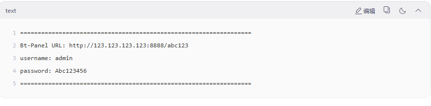

访问上述URL地址


### 1.2宝塔安装WordPress

#### 安装docker


**方案A**：在宝塔右侧docker选择默认安装


**方案B**：

```bash
# 1. 安装依赖
sudo apt update && sudo apt install -y ca-certificates curl gnupg lsb-release

# 2. 添加 GPG 密钥
sudo install -m 0755 -d /etc/apt/keyrings
curl -fsSL https://mirrors.aliyun.com/docker-ce/linux/ubuntu/gpg | sudo gpg --dearmor -o /etc/apt/keyrings/docker.gpg
sudo chmod a+r /etc/apt/keyrings/docker.gpg

# 3. 添加仓库
echo "deb [arch=$(dpkg --print-architecture) signed-by=/etc/apt/keyrings/docker.gpg] https://mirrors.aliyun.com/docker-ce/linux/ubuntu $(lsb_release -cs) stable" | sudo tee /etc/apt/sources.list.d/docker.list > /dev/null

# 4. 安装 Docker
sudo apt update
sudo apt install -y docker-ce docker-ce-cli containerd.io docker-buildx-plugin docker-compose-plugin

# 5.设置自启动
sudo systemctl enable docker

# 6.检查是否运行
sudo systemctl status docker
```


**方案C**：[Linux | Docker Docs](https://docs.docker.com/desktop/setup/install/linux/)根据Docker官网上配置


#### 配置Docker加速镜像


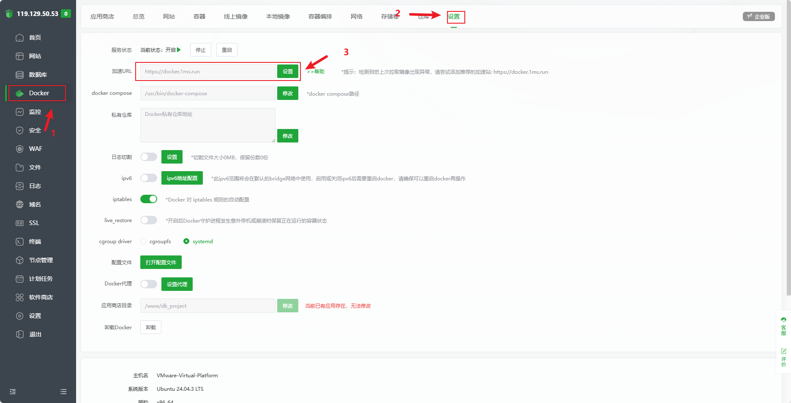


#### 安装wordpress

如图**按顺序**安装(优先安装左侧的Docker)

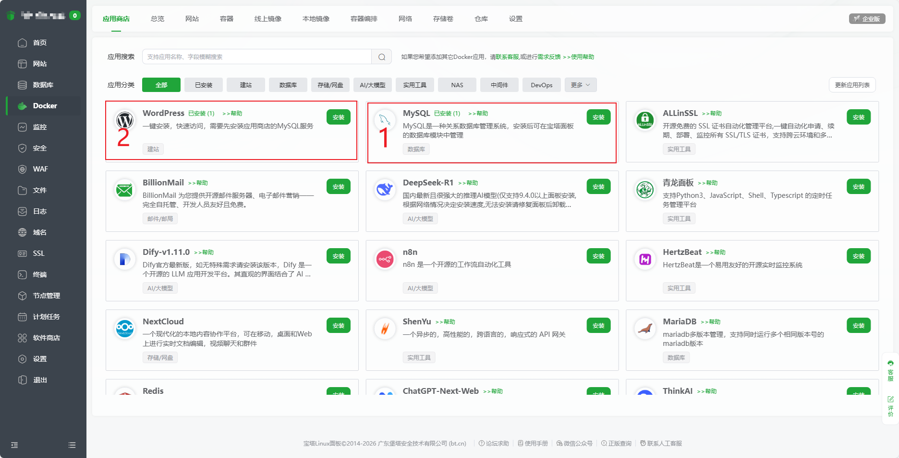


成功后如下（会显示**运行中**）

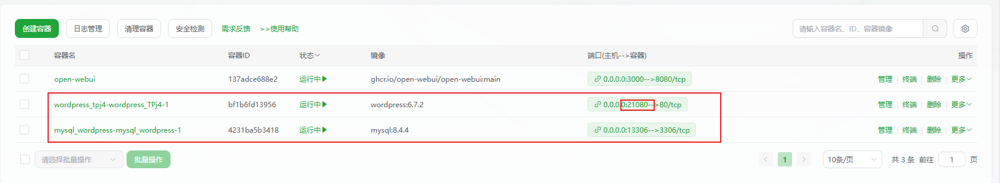

记录红框**端口号**

```bash
 ip a
```

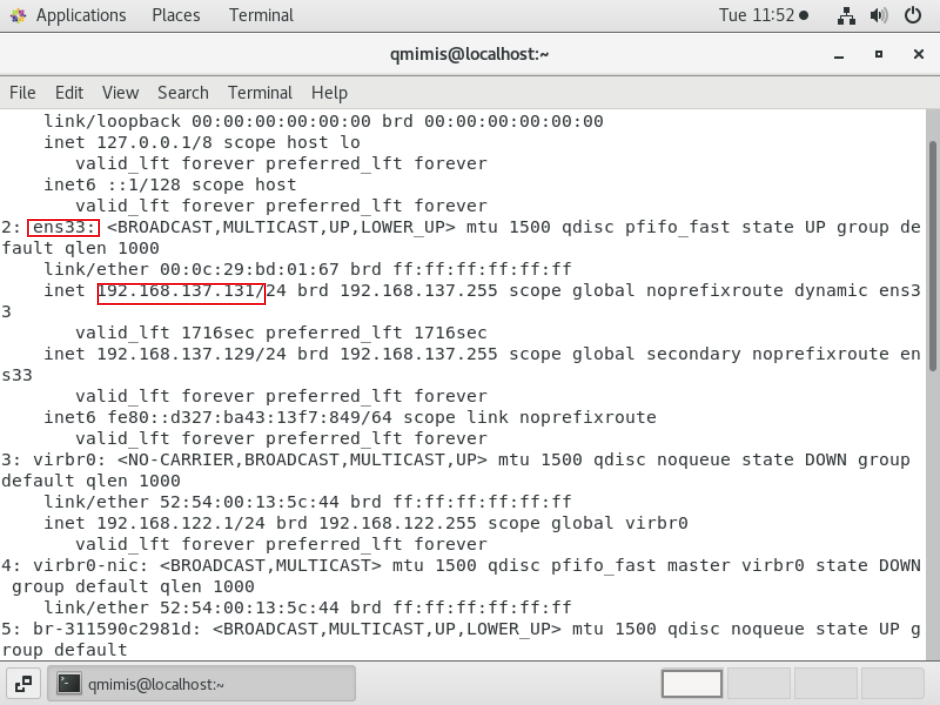

记录IP，以IP+端口号的形式在浏览器上打开。

1.注册当前WordPress的账号（需记录）

2.登录使用WordPress


#### 安装插件（推荐插件）


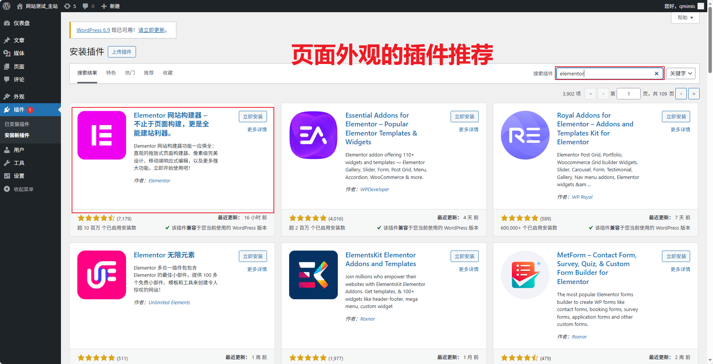
上述插件需要在主页右侧插件点击启用后，再点击对应插件配置启用，如下图（可能需要绑定账号等才能启用）

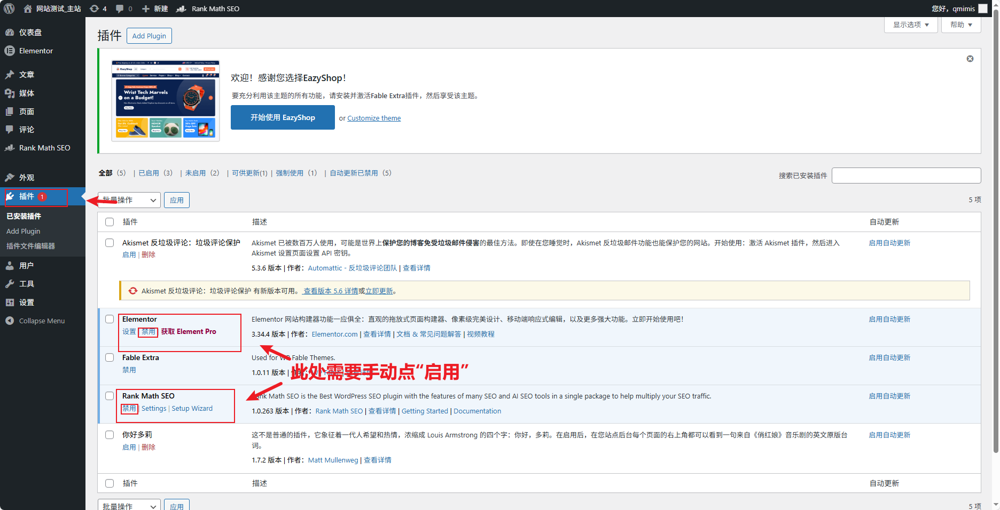
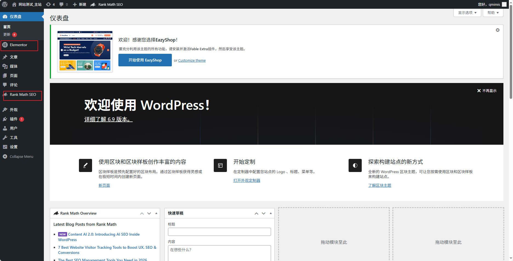


#### 安装主题（推荐主题）


#### **使用 WordPress 多站点（Multisite）功能**

编辑网站根目录下的 `wp-config.php` 文件，在 `/* That's all, stop editing! */` 之前添加：

```php
   define('WP_ALLOW_MULTISITE', true);
   
```

1. **进入后台** → 工具 → 网络设置
   按提示选择“子域名”或“子目录”模式（注意：子域名需服务器支持泛解析）。
2. **按指引修改 `wp-config.php` 和 `.htaccess`**
   WordPress 会给出具体代码，复制粘贴即可。
3. **完成安装后**，可在“我的站点”中创建第二个站点（如 `/site2` 或 `site2.yoursite.com`）。


#### WordPress的导入导出

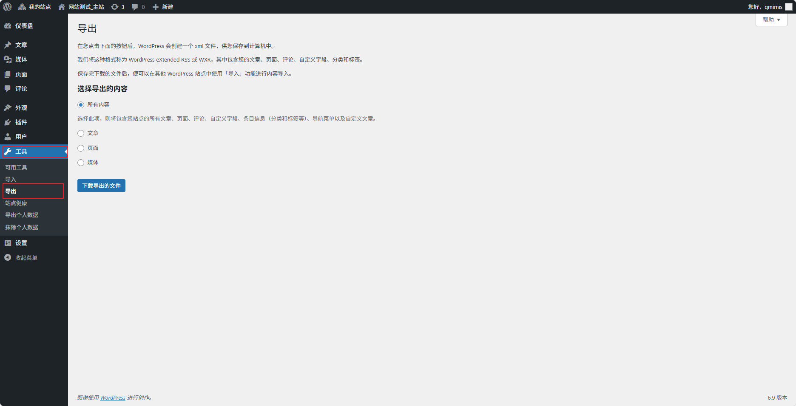

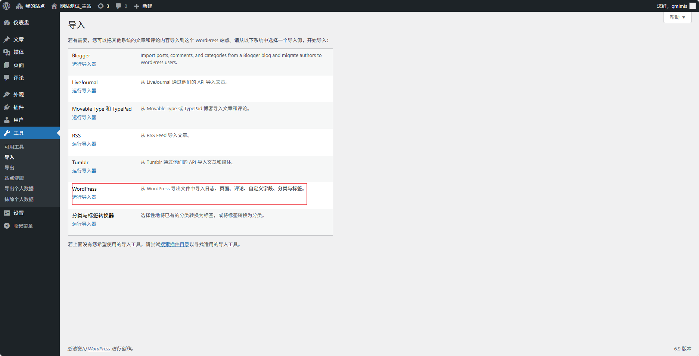

## 2.Cloudflare

Cloudflare，域名


### 2.1使用Cloudflare配置反向代理

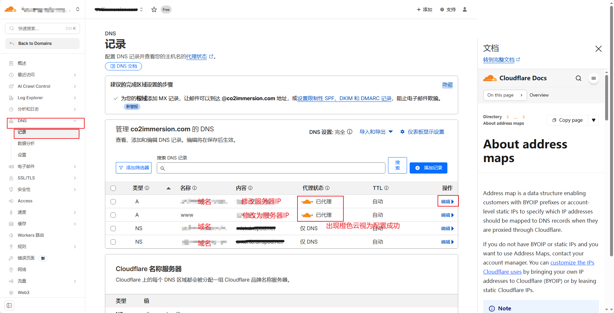


### 2.2更改上述NS

1.Cloudflare 会提供两个 NS 地址，如上图中NS后的内容部分。
2.登录你的域名注册商（如 GoDaddy、Namecheap、阿里云），将 NS 记录改为 Cloudflare 提供的这两个。
3.等待 DNS 生效（通常几分钟到几小时）。


### 2.3验证反向代理是否生效**

```bash
dig example.com +short
```

显示有cloudfare字样视为成功


### 2.4配置服务器防火墙

```bash
# 1. 允许本地回环（必须）
sudo ufw allow from 127.0.0.1

# 2. 允许你自己的公网 IP 访问管理端口（最安全！）
# 替换 YOUR_HOME_IP 为你的家庭/办公公网 IP（可通过 https://ip.cn 查看）
YOUR_HOME_IP="203.0.113.50"
sudo ufw allow from  $ YOUR_HOME_IP to any port 22    # SSH
sudo ufw allow from  $ YOUR_HOME_IP to any port 8888  # 宝塔面板
# 如需其他端口（如数据库 3306），也在这里加

# 3. 允许 Cloudflare IP 访问 Web 端口（80/443）
curl -s https://www.cloudflare.com/ips-v4 -o /tmp/cf-ipv4.txt
while read ip; do
  sudo ufw allow from " $ ip" to any port 80,443 proto tcp
done < /tmp/cf-ipv4.txt

# 4. 设置默认策略：拒绝所有其他入站连接
sudo ufw default deny incoming
sudo ufw default allow outgoing

# 5. 启用防火墙（会提示确认）
sudo ufw enable
```


## 3.Nginx

使用宝塔面板，在docker中"网站"下载nginx。

在宝塔面板中下载nginx,安装完成后

```nginx
#配置单个
server {
    listen 80;
    server_name example.com www.example.com site1.com www.site1.com site2.net blog.example.org;

    location / {
        proxy_pass http://127.0.0.1:8080;
        proxy_set_header Host  $ host;
        proxy_set_header X-Real-IP  $ remote_addr;
        proxy_set_header X-Forwarded-For  $ proxy_add_x_forwarded_for;
        proxy_set_header X-Forwarded-Proto  $ scheme;
    }
}
```

```nginx
#配置多个
# site1.com → 后端 A
server {
    listen 80;
    server_name site1.com www.site1.com;
    location / {
        proxy_pass http://127.0.0.1:8080;
        ...
    }
}

# site2.net → 后端 B
server {
    listen 80;
    server_name site2.net www.site2.net;
    location / {
        proxy_pass http://127.0.0.1:8081;
        ...
    }
}
```

